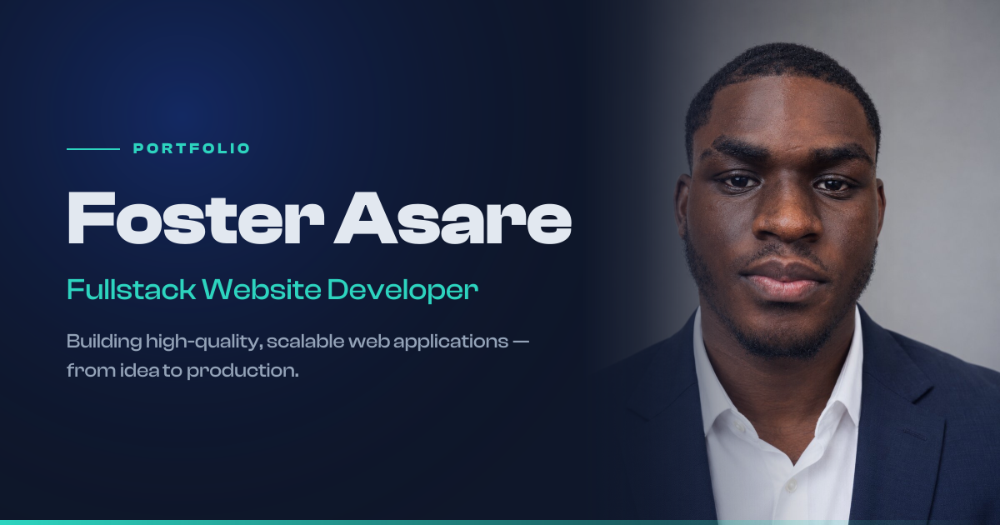

  
  
  
  

## 👋 Hey, I'm Foster

I'm a **fullstack developer** from Ghana 🇬🇭, now based in **Lille, France** 🇫🇷. I build complete web products end to end, from pixel-perfect, accessible interfaces to secure, high-performance APIs.

I work mostly in **React, Next.js, Node.js, NestJS and TypeScript**, and I've shipped the parts that are easy to get wrong: authentication, payments (Paystack, Stripe, mobile money and crypto escrow), real-time features and media storage on AWS S3 and Cloudinary.

**Right now:**

- 💼 **UI/UX Developer** at [ViewEngine](https://viewengine.ai) (remote, US). I turn design mockups into component-driven client sites on a serverless, edge-first platform.
- 🎓 **MSc in Information Systems & Software Engineering** at [JUNIA](https://www.junia.com/en/academics/master-software-engineering-and-information-systems/), Lille (2028). **BSc Computer Science** at [KNUST](https://www.knust.edu.gh/), Kumasi (2027).
- 🇫🇷 Learning French (A1, *petit à petit*)
- 🎧 Outside of code: music, cybersecurity and creative writing

## 🚀 Featured Work

### 🔐 [VeriTrust](https://veritrust-p2p.vercel.app/): escrow-backed P2P marketplace

A buyer's funds stay locked until they have inspected and approved the item.

- Escrow flow covering funding, delivery, release, cancellation, disputes and reviews
- Card, **mobile-money** and **USDT crypto** deposits with server-side verification and wallet payouts
- Real-time order chat (typing and online indicators), KYC verification, refresh-token auth, and an admin panel for disputes and payouts

`React` `Node.js` `Express` `Socket.IO` `Paystack` `Zod`

### 🏨 [Amethyst Suites & Dining](https://amethyst-sd.vercel.app): luxury hotel platform

- Room booking with **real-time availability** and reservation management
- Online payments with **webhook-driven**, server-side verification
- **QR-coded event tickets** with door verification and automated confirmation emails
- Framer Motion animations built on a documented design system

`React` `TypeScript` `Express` `Paystack` `Framer Motion`

### More projects

| Project | What it is | Built with |
| --- | --- | --- |
| **[Architecture Studio](https://architecture-iota-lac.vercel.app/)** | Contemporary architecture showcase with galleries, validated enquiry forms and a content admin | Next.js · TypeScript · React Hook Form |
| **[Logicore](https://logicore-psi.vercel.app)** | Logistics platform for shipments, service requests and client communication | Next.js · TypeScript · Tailwind |
| **[Mafoil](https://mafoil.vercel.app/)** | E-commerce store with auth, wishlist, cart and orders | Next.js · Express · MongoDB · RTK Query |

→ Full archive on [fostersoasare.me](https://fostersoasare.me/archive)

## 🛠️ Tech Stack

| | |
| --- | --- |
| **Frontend** |  |
| **Backend** |  |
| **Data** |  |
| **Cloud & Tools** |  |

I also use Framer Motion, Zustand, Socket.IO, Paystack, Stripe, Cloudinary and Zod / Joi / class-validator, and I work on rate limiting, caching, accessibility and SEO.

## 💼 Experience

| Role | Company | When |
| --- | --- | --- |
| UI/UX Developer | [ViewEngine](https://viewengine.ai) · Remote (US) | Aug 2026 to present |
| Fullstack Developer | Homebasket · Kumasi, Ghana | Nov 2024 to Feb 2025 |
| Frontend Developer | [CediRates](https://cedirates.com) · Accra, Ghana | Feb 2023 to Jun 2023 |
| Frontend Developer | [WalletHack](https://wallethack.com) · Remote (US) | Nov 2022 to Mar 2023 |
| Web Developer | UNIFIN · Remote (UK) | Apr 2022 to Nov 2022 |

## 📊 GitHub Activity

  

  
  

<i>Open to internships, freelance work and interesting problems. The fastest way to reach me is <a href="mailto:fostersoasare@gmail.com">email</a>.</i>

